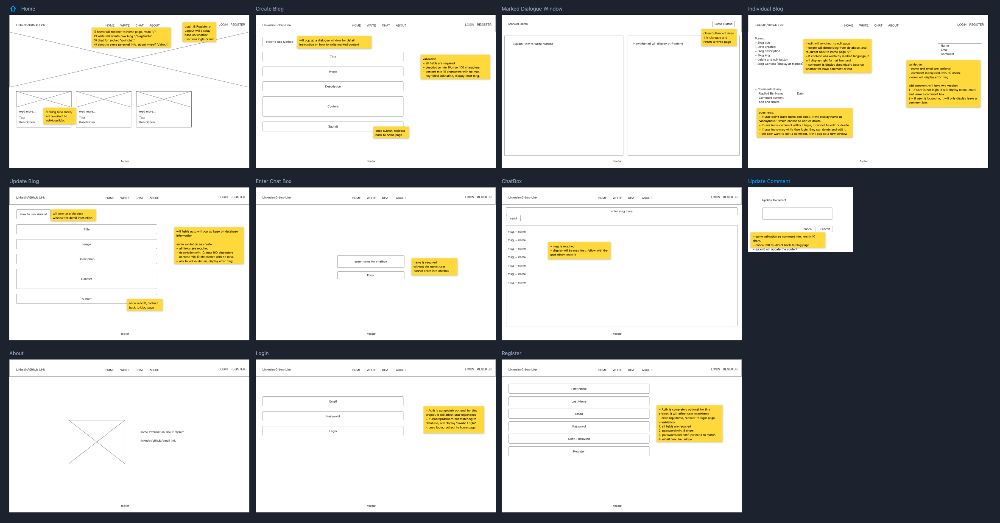

# Blog
MERN project (responsive web application) with Socket.io

------------------
### MongoDB JSON object format:
* created one to many relationship by subdoc collection (array list)

------------------
### Wireframe:

------------------
### Tech/framework used
__Built with__
- react as frontend, mongoose as database, node.js and express as backend
- Redux for global state management
- Material-UI for styling and display
- JSX for frontend template
- cookies and JSON Web Tokens for Authentication
- cors for two localhosts communication and socket
- marked dependency for better content display
- socket.io for instant chatbox

------------------
### Spotlights:
1. Built full CRUD MERN project
2. MERN Auth. is completely different in compare with Java and Python
3. Socket.io for instant communication
4. Instead of useState, tried Redux for globalized state management
5. Tried Material-IU for the first time
6. Learned NoSQL database and store information as JSON object

------------------
### Difficulties:
1. Redux, it's a hard concept to understand, and how data flow works in redux. what's reducer, what's actions, and what's dispatch etc. After drawing out the dataflow, it helped me alot by following the diagram. It's especially helpful with Auth., and we can pull information from redux to see whether the user was logged in or not and display the frontend dynamically 
2. MERN Auth.: is the hardest Auth. I have ever tried it. In comparison with Java and Python, the logic was quite easy, but with MERN, it's hard with setting up the cookies, and JSON Web Token. Not to mention we need to build a Middleware ourselves
3. Socket.io: Compared with the above two, socket is a bit easier to understand, I built a simple chat app for users to communicate. Maybe later I will expand it to different chat rooms and display all users in the chat room with this kind of feature.
4. How to maintain user experience while they don't require to login and register. All my previous projects need login and registration to perform some kind of function, but with MERN, it's completely optional, and users gain the same level of access as login users. How to set up the logic and display is a bit of a brainstorm, and with redux, it's definitely helpful.
